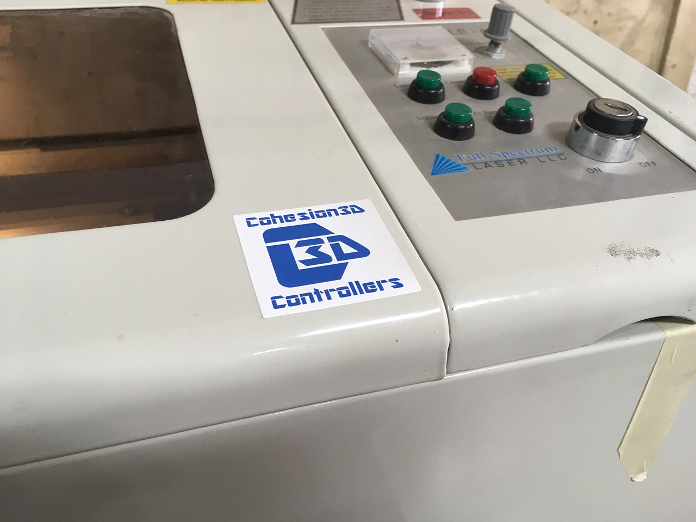

# RasterLaser

RasterLaser is the (unofficial) name of my Laser Cutter.

It's an old Full Spectrum 4th Generation Series 40w Hobby Laser that I upgraded with a Cohesion3D Mini control board. (I also "upgraded" it with a 35 watt tube.) The cutting area is 370mm x 238mm, specified in LightBurn.

I wanted to drop my config.txt file here in case it's useful to others. (And now it's in version control for me, which is also helpful.)

There's a blog post here that walks through the upgrade:

  http://rasterweb.net/raster/2018/05/04/cohesion3d-mini-full-spectrum-laser/

If you want to do the same upgrade, check out the LaserBoard from Cohesion3D. It's basically a newer and much improved version of the Mini board I am using.

  https://cohesion3d.com/

---

Pete Prodoehl

<http://rasterweb.net/raster/>

<pete@2xlnetworks.com>

